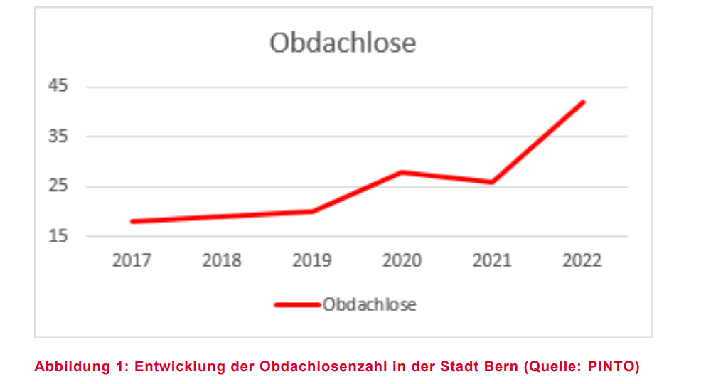
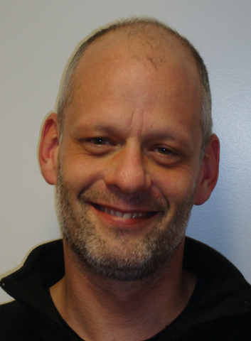
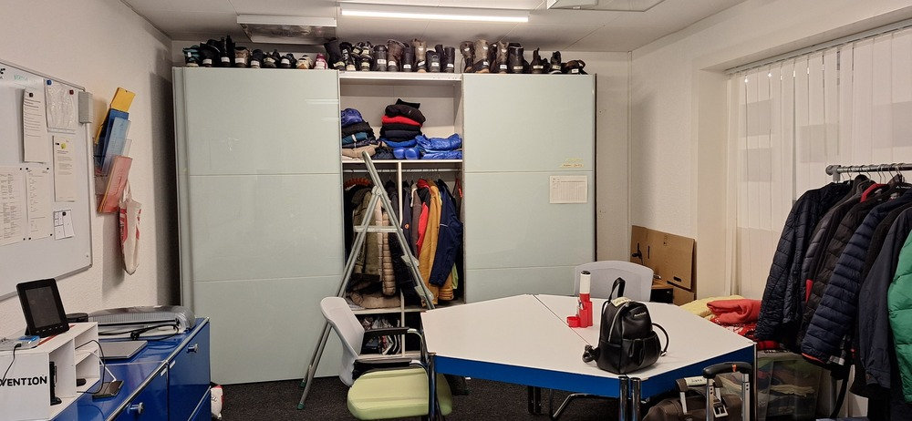

+++
title = "Unter der Brücke"
date = "2024-05-24"
draft = false
pinned = false
tags = ["Deutsch", "Reportage"]
+++
## Wenn die Suche nach einem Schlafplatz den Alltag bestimmt

**Melanie Löhrer, Anne Inderbitzi**



Sie leben auf der Strasse, sie haben kein Zuhause. Sie sind da, doch werden kaum als Menschen wahrgenommen. Obdachlose haben es schwer und es werden immer mehr. Wie kommt es dazu, dass Menschen obdachlos werden? Unternimmt der Staat die erforderlichen Massnahmen nicht? Und wie (über-)leben obdachlose Menschen hier in der Stadt Bern?



Leo N.* sucht nach einem Schlafplatz, eine Suche, die den ganzen Tag einnimmt. Wir treffen ihn auf der kleinen Schanze an, dort habe er noch nie geschlafen, es sei ihm zu wenig sicher. «Mein ganzer Alltag ist von vielen Unsicherheiten geprägt», erzählt Leo N., er wisse nie, wie der Tag ausgehen würde. Lange Zeit gab es keine Studien und schon gar nicht Zählungen von Obdachlosen. Erst 2020 haben Forscher der Fachhochschule Nordwestschweiz eine Studie dazu durchgeführt. Heute leben ungefähr 2200 Menschen obdachlos in der Schweiz. In Bern sind es zurzeit etwa 45. Studien belegen, dass die Zahl der Obdachlosen in Bern und auch allgemein in der Schweiz in den letzten Jahren angestiegen ist. Auch unser Interviewpartner Leo kann dem zustimmen: «Ich sehe immer mehr Menschen und vor allem auch junge Menschen, die auf der Strasse landen (…).»

Deckt die Stadt Bern mit ihren Hilfsangeboten den Bedarf aller Personen? Insbesondere in den Wintermonaten wächst die Nachfrage nach Notschlafstellen. Es hat nicht mehr genug für alle, die darauf angewiesen sind. Im November 2023 wurde die «Strategie Obdach» vom Gemeinderat der Stadt Bern verabschiedet.  Ziel ist, kurzfristig die Lücken in den bestehenden Angeboten zu schliessen, sowie längerfristig die Finanzierung der bestehenden und neuen Pilotprojekte zu sichern.

Es gibt demnach vom Staat oder dem Kanton bereits Angebote, um obdachlose Personen zu unterstützen. Doch wer ist dafür zuständig? Der Staat, der Kanton oder doch die Gemeinden? Das ist gesetzlich nicht klar geregelt. Der Kanton Bern übernimmt einen guten Teil der Finanzierung von Projekten hier in Bern, oftmals das, was die Institution nicht selbst bezahlen kann. Der Sozialdienst ist schweizweit geregelt, jedoch haben nur Schweizerbürger*innen das Recht darauf. Doch auch nicht alle Obdachlosen können oder wollen sich beim Sozialamt melden. Sei es aufgrund Hemmungen oder, was meist der Fall ist, psychischen Erkrankungen. Die aufwändige Bürokratie, die damit einhergeht, ist für viele nicht zu bewältigen. Etwa 80% aller Obdachlosen sind von psychischen Krankheiten betroffen, was häufig auch ein Mitgrund für die Obdachlosigkeit ist. Der Alltag ist für diese Personen viel schwieriger und wer einmal in der Obdachlosigkeit ist, für den ist der Ausweg sehr schwer. Solche Personen benötigen psychologische Unterstützung, die bereits für Personen mit Krankenversicherung, Wohnung und Arbeit schwer zu bekommen ist. Zusätzlich haben viele Obdachlose mit psychischen Krankheiten keine wirkliche Diagnose. Aus Sicht des Teamleiters der Pinto Bern, Silvio Flückiger, bräuchte es eine gesamtschweizerische Lösung. Die Verteilung der Notschlafstellen sollte optimalerweise nach Bevölkerungszahlen verteilt werden. So könnten Obdachlose dort bleiben, wo sie ihren Lebensmittelpunkt hatten. Heutzutage ist das Problem, dass man mit genau so vielen Schlafplätzen, wie Obdachlose in der jeweiligen Gemeinde sind, nicht genug hat. Wenn an einem Ort die Notschlafstellen ausgebaut werden, spricht sich dies herum und es kommen mehr Leute, vor allem wenn es ein gutes Angebot ist, aber auch wenn es ein weniger attraktives aber dringend benötigtes Angebot ist. Ein gutes Beispiel dafür ist Lausanne. Im Corona-Winter waren die Notschlafstellen dort kostenlos. Dies hatte sich herumgesprochen und Leute aus anderen Städten, auch hier aus Bern, waren nach Lausanne gegangen. Somit hatte es in Lausanne zu wenige Schlafstellen für alle gehabt, die eine benötigt hatten. Wie wird dann entschieden, wer drinnen und wer draussen schläft? Laut Silvio Flückiger gelte im Prinzip «dr Ender isch dr Gschwinder». Diejenigen, die keinen Platz mehr in der Notschlafstelle haben, dürften sich einen Winterschlafsack nehmen bei der Pinto, erzählt er uns. Doch an einen Grundsatz hielten sie bei der Pinto immer fest: «Kein Kind schläft draussen. Da werden im Notfall auch Hotels bezahlt.»

«Obdachlose» - stark stigmatisiert in der Gesellschaft, «alles deine eigene Schuld», «geh doch arbeiten!», all das sind geläufige Aussagen. Doch was steckt wirklich dahinter? Wieso wird jemand obdachlos? Das sind unterschiedliche Gründe. In den letzten Jahren stieg die Anzahl Obdachlose mit Migrationshintergrund extrem an. Menschen aus Spanien, Österreich, Deutschland und anderen Ländern kommen in die Schweiz, in der Hoffnung auf ein besseres Leben. Doch Asyl wird diesen Personen nicht gewährt, und oftmals befinden sie sich bereits am Existenzminimum und haben kein Anrecht auf Sozialhilfe, da sie keine Schweizerbürger*innen sind. Dadurch werden sie obdachlos. Diesen Personen wird häufig ein Ticket zurück ins Heimatland bezahlt, denn dort haben sie zumindest Anrecht auf Sozialleistungen. Jedoch sind auch viele Schweizer betroffen, denn es herrscht Wohnungsknappheit und die Preise für Wohnungen steigen. Menschen, die sowieso schon knapp bei Kasse sind, können sich ihre Wohnung nicht mehr leisten, und ohne Wohnung verliert man schnell auch den Job. Die Pinto nimmt Kontakt zu diesen Leuten auf und unterstützt sie, in dem, was sie gerade brauchen. «Der Hauptauftrag der Pinto ist die aufsuchende Sozialarbeit», meint Silvio Flückiger. Von seinem 8¼-stündigen Arbeitstag verbringt er 5½ Stunden auf der Strasse, auf der Suche nach hilfsbedürftigen Menschen. Hier im Büro, in dem wir uns für das Interview befinden, können die Obdachlosen kostenlos duschen, ihre Wäsche waschen und ihre Wertsachen in Schliessfächern aufbewahren. Auch können sie sich eindecken mit Kleidern und Schuhen, die sie gerade brauchen und das sogenannte «offene Büro» nutzen – die Personen können mit den Mitarbeitern sprechen, sich Hilfe holen, oder auch einfach mal erzählen. Die Materialien erhält Pinto durch Sachspenden. Wenn man etwas spenden möchte, kann man es, so sagt Silvio Flückiger, «einfach vorbeibringen». Sponsorengelder können sie nicht annehmen, da Pinto eine Institution des Kantons Bern ist. 

Wenn wir persönlich Obdachlose auf der Strasse antreffen, wissen wir häufig nicht, wie wir das Gespräch starten oder ihnen etwas anbieten können. Silvio Flückiger schlägt uns vor, den Obdachlosen auf Augenhöhe zu begegnen. Wir sollten die Person freundlich ansprechen und sie fragen, ob sie etwas bräuchten. Diejenigen, die gerne mit uns sprechen wollen werden darauf auch entsprechend reagieren und andere eben nicht. «Ein Lächeln oder ein paar liebe Worte, machen teilweise schon viel aus.», meint Leo N. zu dem Umgang mit Obdachlosen, «Natürlich ist das Geld für den Alltag nützlicher, doch auch diese Momente zählen.» Freundlichkeit, Verständnis und Hilfsbereitschaft sind sicher drei Möglichkeiten, wie man mit einer obdachlosen Person umgehen kann. 

Wir waren ebenfalls daran interessiert, wie der Umgang von Obdachlosen untereinander aussieht. Dazu haben Leo N. gefragt. Er meinte, dass der Umgang unter den Obdachlosen sehr unterschiedlich sei. «Es kommt auf die Personen und Situation an, wie Situation ausgeht. Manchmal kommt es zu Schlägereien, aber es gibt auch ganz schöne Momente.» Man kenne sich untereinander und weise einander auf Anlaufstellen und Schlafplätze hin.

Heute Nacht werde er es wieder beim Sleeper versuchen, teilt er uns bei der Verabschiedung mit. Und wenn es dort keinen Platz mehr habe, wisse er noch nicht, wo er schlafen werde. Vielleicht probiert er es trotzdem hier auf der kleinen Schanze, wenn er nichts anderes findet. Aber das bleibt ungewiss, bis die Nacht hereinbricht. 

Obdachlosigkeit war, ist und wird auch immer ein wichtiges und leider viel zu wenig sensibilisiertes Thema bleiben. Es ist viel zu einfach, die Tatsache, dass man tagtäglich an obdachlosen Menschen vorbeiläuft, zu ignorieren. Doch die bittere Realität ist: Es kann jeden treffen und genau deshalb sind solche Hilfsangebote auch notwendig. Viel zu viele Menschen sind obdachlos, obwohl es entsprechende Hilfsangebote gibt. Und wir dürfen nicht vergessen: Jeder von ihnen hat eine Geschichte, jeder von ihnen hat Träume und Hoffnungen, die oft durch Umstände jenseits ihrer Kontrolle zerstört wurden. Wir müssen uns als Gesellschaft dafür einsetzen, dass niemand mehr gezwungen ist, sein Leben auf der Straße zu verbringen. Dafür brauchen wir nicht nur politische Maßnahmen und finanzielle Unterstützung, sondern auch Mitgefühl, Empathie und die Bereitschaft, uns persönlich für die Bedürfnisse der Obdachlosen einzusetzen. Wenn Leo N. heute Nacht wieder auf der Suche nach einem Schlafplatz ist, sollten wir uns daran erinnern, dass er nicht allein ist. Millionen von Menschen auf der ganzen Welt kämpfen jeden Tag mit denselben Herausforderungen. Es liegt an uns, ihre Stimmen zu hören und uns für eine Welt einsetzen, in der niemand jeden Tag darum bangen muss, wo er die nächste Nacht verbringen wird. 

{{<box}}

Hier ist eine Liste mit Notschlafstellen und Aufenthaltsräumen für Obdachlose in Bern:

* Notschlafstelle Passantenheim der Heilsarmee; Muristrasse 6, 3006 Bern
* Notschlafstelle Sleeper & Gassenküche; Neubrückstrasse 19, 3012 Bern -> 5-10 CHF
* Jugend-Notschlafstelle Pluto; Studerstrasse 44, 3004 Bern -> gratis
* Aufenthaltsraum AKIB; Postgasse 35, 3011 Bern
* Punkt 6, Nägeligasse 3a, 3011 Bern -> derzeit geschlossen, öffnet wieder am 01.11.2024 



*\*Name der Redaktion bekannt*